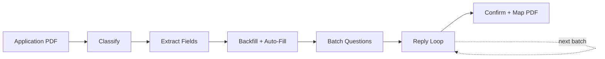

CL SDK provides a full agentic pipeline for processing insurance applications. Small, focused agents handle classification, field extraction, auto-fill, question batching, reply routing, and PDF mapping — running in parallel where possible and using persistent state with vector-based answer backfill.

## Quick start

```typescript
import { createApplicationPipeline } from "@claritylabs/cl-sdk";

const pipeline = createApplicationPipeline({
  generateText,
  generateObject,
  applicationStore,      // persistent state storage
  documentStore,         // for policy/quote lookups during auto-fill
  memoryStore,           // for vector-based answer backfill
  orgContext: [
    { key: "company_name", value: "Acme Corp", category: "company_info" },
    { key: "company_address", value: "123 Main St", category: "company_info" },
  ],
});

// Process a new application PDF
const { state } = await pipeline.processApplication({
  pdfBase64: "...",
  applicationId: "app-123",
});

// Generate email for current batch of questions
const { text: emailBody } = await pipeline.generateCurrentBatchEmail("app-123");

// Process user's reply
const { fieldsFilled, responseText } = await pipeline.processReply({
  applicationId: "app-123",
  replyText: "1. Yes\n2. $1,000,000\n3. Check our website",
});
```

## Pipeline phases



### Phase 1: Classify

A tiny agent determines whether the PDF is an insurance application form. Returns immediately if not, saving all downstream processing.

### Phase 2: Extract fields

Extracts all fillable fields as structured data — text, numeric, currency, date, yes/no, table, and declaration types. Each field gets an ID, label, section, type, and required flag.

### Phase 3: Backfill + auto-fill (parallel)

Three fill strategies run in parallel to maximize pre-filled fields before asking the user anything:

1. **Vector backfill** — searches prior application answers via the `BackfillProvider` interface. Uses embedding similarity to find answers from previous applications that match the current fields.
2. **Context auto-fill** — matches fields to business context key-value pairs (company name, address, FEIN, etc.) using an LLM agent.
3. **Document search** — searches extracted policy/quote chunks for relevant data via the memory store.

### Phase 4: Batch questions

Groups remaining unfilled fields into topic-based batches (3-8 batches). Keeps related fields together (address components, conditional fields with their parents). Orders by importance: company info first, declarations last.

### Phase 5: Reply loop

For each batch, the pipeline:

1. **Generates a professional email** requesting answers for the batch
2. **Classifies the user's reply** — answers, questions about fields, lookup requests, or mixed
3. **Routes to the right agent:**
   - Answers → parsed and applied to state
   - Questions → field explanation generated
   - Lookup requests → searches documents/records to fill fields
4. **Advances to the next batch** when current batch is complete

### Phase 6: Confirm + map PDF

Generates a confirmation summary for user review, then maps filled values to the PDF (AcroForm fields or flat text overlay coordinates).

## Focused agents

Each agent has a simple prompt designed for small, fast models:

| Agent | Task | Typical tokens |
|-------|------|---------------|
| `classifier` | Detect if PDF is an application | 512 |
| `field-extractor` | Extract all form fields | 8192 |
| `auto-filler` | Match fields to business context | 4096 |
| `batcher` | Group fields into topic batches | 2048 |
| `reply-router` | Classify reply intent | 1024 |
| `answer-parser` | Extract answers from replies | 4096 |
| `lookup-filler` | Fill from policy/record lookups | 4096 |
| `email-generator` | Generate batch emails | 2048 |

## Persistent state

The `ApplicationStore` interface persists application state across the multi-turn collection process:

```typescript
interface ApplicationStore {
  save(state: ApplicationState): Promise<void>;
  get(id: string): Promise<ApplicationState | null>;
  list(filters?: { status?: string; title?: string }): Promise<ApplicationState[]>;
  delete(id: string): Promise<void>;
}
```

`ApplicationState` tracks: fields (with values and sources), batches, current batch index, and status (`classifying` → `extracting` → `auto_filling` → `batching` → `collecting` → `confirming` → `mapping` → `complete`).

## Vector-based answer backfill

The `BackfillProvider` interface enables searching prior answers to pre-fill new applications:

```typescript
interface BackfillProvider {
  searchPriorAnswers(
    fields: { id: string; label: string; section: string; fieldType: string }[],
    options?: { limit?: number },
  ): Promise<PriorAnswer[]>;
}
```

This is how the pipeline gets faster over time — each completed application makes future applications faster by providing more answers for backfill.

## Individual prompt functions

For custom pipelines, the underlying prompt functions are still exported:

```typescript
import {
  APPLICATION_CLASSIFY_PROMPT,
  buildFieldExtractionPrompt,
  buildAutoFillPrompt,
  buildQuestionBatchPrompt,
  buildAnswerParsingPrompt,
  buildConfirmationSummaryPrompt,
  buildBatchEmailGenerationPrompt,
  buildReplyIntentClassificationPrompt,
  buildFieldExplanationPrompt,
  buildFlatPdfMappingPrompt,
  buildAcroFormMappingPrompt,
  buildLookupFillPrompt,
} from "@claritylabs/cl-sdk";
```
