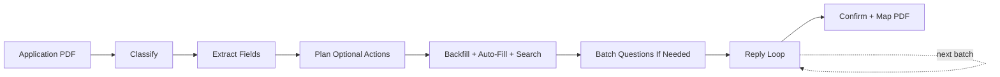

CL SDK provides a full agentic pipeline for processing insurance applications. Small, focused agents handle classification, field extraction, auto-fill, question batching, reply routing, and PDF mapping. Deterministic helpers turn extracted fields into versioned question graphs, filter inactive conditional questions, propose reusable context writes, and assemble broker-ready packets. A bounded workflow planner decides which optional agents are useful from the current state, so the pipeline can handle edge cases without running every storage lookup or provider call on every application.

## Quick start

```typescript
import {
  buildApplicationPacket,
  createApplicationPipeline,
  extractQuestionGraphFromFields,
  planNextApplicationQuestions,
} from "@claritylabs/cl-sdk/application";

const pipeline = createApplicationPipeline({
  generateText,
  generateObject,
  applicationStore,      // persistent state storage
  documentStore,         // for policy/quote lookups during auto-fill
  memoryStore,           // for vector-based answer backfill
  orgContext: [
    { key: "company_name", value: "Acme Corp", category: "company_info" },
    { key: "company_address", value: "123 Main St", category: "company_info" },
  ],
});

// Process a new application PDF
const { state } = await pipeline.processApplication({
  pdfBase64: "...",
  applicationId: "app-123",
  sourceSpans, // optional page/field evidence from the application PDF
});

const graph = extractQuestionGraphFromFields(state.fields, {
  id: "template-1:graph",
  title: state.title,
});
const next = planNextApplicationQuestions({ ...state, questionGraph: graph });
const packet = buildApplicationPacket(state);

// Generate email for current batch of questions
const { text: emailBody } = await pipeline.generateCurrentBatchEmail("app-123");

// Process user's reply
const { fieldsFilled, responseText } = await pipeline.processReply({
  applicationId: "app-123",
  replyText: "1. Yes\n2. $1,000,000\n3. Check our website",
  replySourceSpanIds: ["email-789:span:0"],
});
```

## Pipeline phases



### Phase 1: Classify

A tiny agent determines whether the PDF is an insurance application form. Returns immediately if not, saving all downstream processing.

### Phase 2: Extract fields

Extracts all fillable fields as structured data — text, numeric, currency, date, yes/no, table, and declaration types. Each field gets an ID, label, section, type, and required flag.

### Phase 3: Plan optional fill actions

The planner looks at extracted fields, available stores, org context, and current completion state before launching optional work. It can choose:

- **Vector backfill** — only when a `BackfillProvider` is configured and unfilled fields are worth searching
- **Context auto-fill** — only when `orgContext` is available and fields can plausibly match known business facts
- **Document search** — only for selected high-value fields when document or memory stores are configured
- **Batching** — only when unfilled fields remain after optional fill work

Selected fill strategies run in parallel to maximize pre-filled fields before asking the user anything.

When `sourceSpans` are passed to `processApplication`, the pipeline forwards them to classification and field extraction. Reply answers preserve caller-provided `replySourceSpanIds`, and source-backed backfill can preserve `sourceSpanIds` returned by host stores. Hosts should keep those spans attached to review and packet surfaces.

### Phase 4: Batch questions if needed

Groups remaining active unfilled fields into topic-based batches (3-8 batches). Related fields stay together, but inactive conditional fields are skipped until their parent answer triggers them. Orders by importance: company info first, declarations last.

### Phase 5: Reply loop

For each batch, the pipeline:

1. **Generates a professional email** requesting answers for the batch
2. **Classifies the user's reply** — answers, questions about fields, lookup requests, or mixed
3. **Plans the needed actions** from the reply intent and current batch state
4. **Routes to the right agent:**
   - Answers → parsed and applied to state
   - Questions → field explanation generated
   - Lookup requests → searches documents/records to fill fields
5. **Advances to the next batch** when current batch is complete

### Phase 6: Confirm + map PDF

Generates a confirmation summary for user review, then maps filled values to the PDF (AcroForm fields or flat text overlay coordinates).

## Focused agents

Each agent has a simple prompt designed for small, fast models:

| Agent | Task | Typical tokens |
|-------|------|---------------|
| `classifier` | Detect if PDF is an application | 512 |
| `field-extractor` | Extract all form fields | 8192 |
| `auto-filler` | Match fields to business context | 4096 |
| `batcher` | Group fields into topic batches | 2048 |
| `reply-router` | Classify reply intent | 1024 |
| `answer-parser` | Extract answers from replies | 4096 |
| `lookup-filler` | Fill from policy/record lookups | 4096 |
| `email-generator` | Generate batch emails | 2048 |

## Persistent state

The `ApplicationStore` interface persists application state across the multi-turn collection process:

```typescript
interface ApplicationStore {
  save(state: ApplicationState): Promise<void>;
  get(id: string): Promise<ApplicationState | null>;
  list(filters?: { status?: string; title?: string }): Promise<ApplicationState[]>;
  delete(id: string): Promise<void>;
}
```

`ApplicationState` tracks: pinned template metadata, optional `questionGraph`, fields with values and sources, batches, current batch index, context proposals, optional packet, and status (`classifying` → `extracting` → `auto_filling` → `batching` → `collecting` → `confirming` → `mapping` → `packet_ready` / `submitted` / `complete`).

Fields can also carry source span IDs for values derived from PDF text, prior answers, user replies, or lookup evidence. Hosts should display those references beside auto-filled answers before final PDF mapping.

## Question graphs, context proposals, and packets

Application fields remain available for backwards compatibility, but new intake flows should pin a versioned `ApplicationQuestionGraph` on every run. Graph helpers provide:

- `extractQuestionGraphFromFields(fields, options)` / `buildQuestionGraphFromFields(fields, options)`
- `flattenQuestionGraph(graph)`
- `getActiveApplicationFields(state)`
- `planNextApplicationQuestions(state)`

After answers are collected, use `proposeContextWrites(state)` to produce host-reviewable facts for org memory. Use `buildApplicationPacket(state)` and `validateApplicationPacket(packet)` to produce a broker-ready answer packet with missing-field and quality status. Packets are `draft` until active required fields are answered and the quality report has no blocking issues.

## Vector-based answer backfill

The `BackfillProvider` interface enables searching prior answers to pre-fill new applications:

```typescript
interface BackfillProvider {
  searchPriorAnswers(
    fields: { id: string; label: string; section: string; fieldType: string }[],
    options?: { limit?: number },
  ): Promise<PriorAnswer[]>;
}
```

This is how the pipeline gets faster over time — each completed application makes future applications faster by providing more answers for backfill.

The pipeline can also use `MemoryStore.search()` for selected high-value fields. Chunks only auto-fill fields when they carry an explicit `metadata.value`, `metadata.answer`, or `metadata.fieldValue`; `metadata.sourceSpanIds` is preserved as citable evidence.

## Individual prompt functions

For custom pipelines, the underlying prompt functions are still exported:

```typescript
import {
  APPLICATION_CLASSIFY_PROMPT,
  buildFieldExtractionPrompt,
  buildAutoFillPrompt,
  buildQuestionBatchPrompt,
  buildAnswerParsingPrompt,
  buildConfirmationSummaryPrompt,
  buildBatchEmailGenerationPrompt,
  buildReplyIntentClassificationPrompt,
  buildFieldExplanationPrompt,
  buildFlatPdfMappingPrompt,
  buildAcroFormMappingPrompt,
  buildLookupFillPrompt,
} from "@claritylabs/cl-sdk";
```

For Convex functions, browser-like runtimes, or consumers that only need the application intake engine, import graph/state/packet helpers from `@claritylabs/cl-sdk/application`. The root SDK entrypoint remains available for extraction, PDF, query, source-grounding, and prompt-builder APIs.
