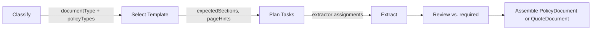

import { Callout } from "@/components/ui/callout";

Classification is the first phase of the extraction pipeline. It automatically determines whether a document is a policy or quote and identifies which lines of business are covered. Classification drives template selection in the Plan phase, which determines which extractors run and what fields are expected.

<Callout type="info">
Classification runs automatically when you call `extractor.extract()`. There is no separate classification function to call — it is integrated into the pipeline.
</Callout>

## What the classifier detects

The classifier uses `generateObject` with the `ClassifyResultSchema` to return three fields:

| Field | Type | Description |
|-------|------|-------------|
| `documentType` | `"policy" \| "quote"` | Whether the document represents bound coverage or proposed coverage |
| `policyTypes` | `string[]` | Lines of business found (e.g., `["general_liability", "commercial_auto"]`) |
| `confidence` | `number` | Confidence score from 0 to 1 |

For this step, the coordinator passes the full PDF through `providerOptions.pdfBase64`. Your `generateObject` callback must attach that PDF to the provider request so the model can actually inspect the document.

### ClassifyResult schema

```typescript
import { z } from "zod";

const ClassifyResultSchema = z.object({
  documentType: z.enum(["policy", "quote"]),
  policyTypes: z.array(PolicyTypeSchema),
  confidence: z.number(),
});
```

## How classification drives the pipeline

The classification result determines everything downstream:

1. **Template selection** — The primary policy type (first element of `policyTypes`) selects a line-of-business template that defines expected sections, page hints, and required fields
2. **Extraction plan** — The Plan phase uses template hints to assign focused extractors to specific page ranges
3. **Review criteria** — The Review phase checks completeness against the template's required fields
4. **Document assembly** — The Assemble phase creates either a `PolicyDocument` or `QuoteDocument` based on `documentType`



## Classification signals

The classifier examines the first few pages of the document and looks for signals such as:

**Policy signals:**
- Policy numbers and declarations pages
- Effective/expiration dates
- Premium charges and bound coverage language

**Quote signals:**
- Quote or proposal numbers
- "Indication" or "proposal" language
- Subjectivities and binding conditions
- Proposed dates

## Supported policy types

The SDK supports 42 policy types across commercial, personal, and specialty lines:

### Commercial lines

| Policy type | Description |
|-------------|-------------|
| `general_liability` | Commercial general liability |
| `commercial_property` | Commercial property |
| `commercial_auto` | Commercial auto |
| `non_owned_auto` | Non-owned / hired auto |
| `workers_comp` | Workers' compensation |
| `umbrella` | Commercial umbrella |
| `excess_liability` | Excess liability |
| `professional_liability` | Professional liability / E&O |
| `cyber` | Cyber liability |
| `epli` | Employment practices liability |
| `directors_officers` | Directors & officers |
| `fiduciary_liability` | Fiduciary liability |
| `crime_fidelity` | Crime / fidelity |
| `inland_marine` | Inland marine |
| `builders_risk` | Builders risk |
| `environmental` | Environmental liability |
| `ocean_marine` | Ocean marine |
| `surety` | Surety bonds |
| `product_liability` | Product liability |
| `bop` | Business owners policy |
| `management_liability_package` | Management liability package |
| `property` | Property (standalone) |

### Personal lines

| Policy type | Description |
|-------------|-------------|
| `homeowners_ho3` | Homeowners HO-3 |
| `homeowners_ho5` | Homeowners HO-5 |
| `renters_ho4` | Renters HO-4 |
| `condo_ho6` | Condo HO-6 |
| `dwelling_fire` | Dwelling fire |
| `mobile_home` | Mobile home |
| `personal_auto` | Personal auto |
| `personal_umbrella` | Personal umbrella |
| `flood_nfip` | Flood (NFIP) |
| `flood_private` | Flood (private) |
| `earthquake` | Earthquake |
| `personal_inland_marine` | Personal inland marine |
| `watercraft` | Watercraft |
| `recreational_vehicle` | Recreational vehicle |
| `farm_ranch` | Farm & ranch |

### Specialty

| Policy type | Description |
|-------------|-------------|
| `pet` | Pet insurance |
| `travel` | Travel insurance |
| `identity_theft` | Identity theft |
| `title` | Title insurance |
| `other` | Unrecognized policy type |

## Multi-line documents

Many commercial documents cover multiple lines of business (e.g., a commercial package policy with GL, property, and auto). The classifier returns all detected policy types in the `policyTypes` array.

The pipeline uses the **first** policy type as the primary type for template selection. The template's expected sections and page hints are tuned to that primary line, but all extractors still run against the full document, capturing data from all lines present.
