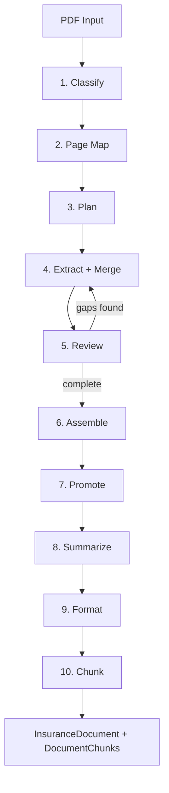

import { Callout } from "@/components/ui/callout";

CL SDK's extraction pipeline uses an agentic coordinator/worker pattern to process insurance documents. It classifies the document, maps pages to focused extractors, builds deterministic tasks, dispatches focused extractors in parallel, runs a full-document supplementary pass for hidden retrieval facts, merges repeated extractor runs, reviews for completeness and quality, assembles a fully typed `InsuranceDocument`, promotes declarations data into typed top-level fields, generates a document summary, and produces retrieval-ready chunks.

## Quick start

```typescript
import { createExtractor } from "@claritylabs/cl-sdk";

const extractor = createExtractor({
  generateText: myGenerateText,   // Your provider callback
  generateObject: myGenerateObject,
  onProgress: (msg) => console.log(msg),
});

const { document, chunks, tokenUsage, usageReporting } = await extractor.extract(pdfBase64, "doc-123");

console.log(document.type);       // "policy" | "quote"
console.log(document.carrier);    // "Hartford"
console.log(chunks.length);       // 42
console.log(tokenUsage);          // { inputTokens: 85000, outputTokens: 12000 }
console.log(usageReporting);      // { modelCalls: 14, callsWithUsage: 14, callsMissingUsage: 0 }
```

<Callout type="info">
CL SDK is provider-agnostic. You supply plain callback functions (`GenerateText`, `GenerateObject`) that wrap your preferred provider (Anthropic, OpenAI, etc.). The SDK never imports any provider package.
</Callout>

## Pipeline overview

The pipeline runs ten phases sequentially. Extraction and review dispatch work in parallel internally.



## Phase 1: Classify

The classifier examines the document and determines:

- **Document type** — `"policy"` (bound coverage) or `"quote"` (proposed coverage)
- **Policy types** — array of line-of-business types (e.g., `["general_liability", "commercial_auto"]`)
- **Confidence** — numeric score from 0 to 1

Classification uses `generateObject` with the `ClassifyResultSchema` and drives template selection in the next phase. The coordinator passes the full PDF through `providerOptions.pdfBase64` for this step. See [Classification](/docs/extraction/classification) for details.

## Phase 2: Page Map

The coordinator first maps each page to one or more focused extractors. This is the step that prevents broad, mixed ranges from sending declaration pages and generic policy forms through the same extractor without distinction.

The page mapper receives chunked PDFs through `providerOptions.pdfBase64` and assigns pages one by one.

## Phase 3: Plan

The planner selects a line-of-business template based on the primary policy type and builds an extraction plan from the page map — a list of tasks that map focused extractors to page ranges.

Each task specifies:
- **Extractor name** — which focused extractor to run (e.g., `declarations`, `coverage_limits`)
- **Page range** — `startPage` and `endPage` for the extractor to focus on

The planner receives template hints including expected sections, page hints, and total page count. In the current coordinator, the plan is built deterministically from the page map rather than delegated to the older broad prompt-only planning path.

### Line-of-business templates

The SDK includes 20 templates covering 42 policy types. Each template defines:

| Field | Description |
|-------|-------------|
| `expectedSections` | Sections the template expects to find (e.g., `["declarations", "coverages", "conditions"]`) |
| `pageHints` | Guidance on where sections typically appear (e.g., `"declarations: pages 1-3"`) |
| `required` | Fields that must be extracted for completeness |
| `optional` | Fields that may or may not be present |

**Available templates:**

| Template | Policy types |
|----------|-------------|
| General Liability | `general_liability` |
| Commercial Property | `commercial_property` |
| Commercial Auto | `commercial_auto`, `non_owned_auto` |
| Workers' Comp | `workers_comp` |
| Umbrella / Excess | `umbrella`, `excess_liability` |
| Professional Liability | `professional_liability` |
| Cyber | `cyber` |
| D&O | `directors_officers` |
| EPLI | `epli` |
| Crime | `crime_fidelity` |
| Inland Marine | `inland_marine` |
| Builders Risk | `builders_risk` |
| Environmental | `environmental` |
| Homeowners | `homeowners_ho3`, `homeowners_ho5`, `renters_ho4`, `condo_ho6` |
| Personal Auto | `personal_auto` |
| Dwelling Fire | `dwelling_fire`, `mobile_home` |
| Flood | `flood_nfip`, `flood_private` |
| Personal Umbrella | `personal_umbrella` |
| Farm & Ranch | `farm_ranch` |
| Default | All other types |

Templates are accessed internally via `getTemplate(policyType)`.

## Phase 4: Extract And Merge

The coordinator dispatches focused extractors in parallel (concurrency-limited, default 2). Each extractor targets a specific data domain against the page range assigned by the plan.

Results accumulate in an in-memory `Map` keyed by extractor name.

Before each worker callback is invoked, the SDK slices the assigned page range with `extractPageRange()` and passes that page-scoped PDF through `providerOptions.pdfBase64`. If `convertPdfToImages` is configured, it passes `providerOptions.images` instead.

If the same extractor runs multiple times, results merge instead of overwrite. This is especially important for `coverage_limits`, `endorsements`, `exclusions`, `conditions`, `sections`, `declarations`, and `supplementary`.

### The 11 focused extractors

| Extractor | Domain | What it extracts |
|-----------|--------|------------------|
| `carrier_info` | Carrier | Carrier name, NAIC, AM Best, MGA, underwriter, broker/producer agency and license |
| `named_insured` | Insured | Insured name, DBA, address, entity type, FEIN, SIC/NAICS, loss payees, mortgage holders |
| `declarations` | Declarations | Line-specific structured declarations (varies by policy type) |
| `coverage_limits` | Coverages | Coverage names, limits, deductibles, forms, triggers |
| `endorsements` | Endorsements | Form numbers, titles, types, content, affected parties |
| `exclusions` | Exclusions | Exclusion titles, content, applicability |
| `conditions` | Conditions | Duties after loss, cancellation, other insurance, etc. |
| `premium_breakdown` | Premium | Premiums, taxes, fees, payment plans, rating basis |
| `loss_history` | Loss history | Loss runs, claim records, experience modification |
| `supplementary` | Supplementary | Regulatory context, contacts, TPA, claims contacts, and hidden retrieval-only facts |
| `sections` | Sections | Raw section content (fallback for unmatched sections) |

Each extractor is defined with `{ buildPrompt(), schema, maxTokens }` and accessed via `getExtractor(name)`.

### Hidden supplementary facts pass

After the page-mapped extractor tasks complete, the coordinator runs a full-document `supplementary` pass across the entire PDF. This pass is intended for memory and retrieval rather than consumer-facing structured output.

The pass still captures regulatory contacts and notice periods, but it also emits `auxiliaryFacts`: normalized key/value facts that do not fit the strict primary schema.

Typical `auxiliaryFacts` include:

- policyholder names
- insured or driver names
- ages and dates of birth
- marital status
- garaging ZIPs
- vehicle-to-driver assignments
- household members
- lienholder and schedule row details

Each auxiliary fact can include optional `subject` and `context` fields so downstream agents can distinguish document-level facts from person-specific or schedule-specific facts.

This data is assembled onto the final document as `supplementaryFacts` and chunked for vector retrieval, but it is meant to remain hidden from normal consumer UI rendering unless your application explicitly chooses to surface it.

## Phase 5: Review

After initial extraction, a review loop (up to `maxReviewRounds`, default 2) checks completeness and quality against the template's `required` fields. The reviewer compares what has been extracted against what is expected, sees the document again, and receives a summary of extracted outputs and page assignments.

If gaps or quality issues are found, the reviewer generates additional extraction tasks. These follow-up extractors are dispatched in parallel, just like the main extraction phase. The loop continues until either:
- All required fields are present, or
- The maximum review rounds are reached

Typical quality issues include generic placeholders like "shown in declarations", "per schedule", and values that look copied from generic form wording instead of declaration-specific schedules.

## Phase 6: Assemble

The assembler merges all extractor results from the in-memory `Map` into a single validated `InsuranceDocument` (either `PolicyDocument` or `QuoteDocument`).

## Phase 7: Promote

After assembly, a promotion pass fills in top-level typed fields from data that was extracted but not directly surfaced. The extractors do detailed work — 100+ declaration fields, dozens of coverages — but the initial assembly only spreads flat results. The promotion pass bridges this gap.

The promoter runs seven sub-passes, all pure data transformations with no model calls:

| Sub-pass | What it does |
|----------|-------------|
| **Carrier field mapping** | Maps extractor short names to canonical schema names (`naicNumber` → `carrierNaicNumber`, `admittedStatus` → `carrierAdmittedStatus`, `amBestRating` → `carrierAmBestRating`). Also builds the structured `insurer` sub-object. |
| **Broker promotion** | Scans declarations for broker/agent/producer fields and promotes to `brokerAgency`, `brokerContactName`, `brokerLicenseNumber`, and the structured `producer` object. Falls back to declarations if the carrier extractor didn't capture broker data. |
| **Loss payee / mortgage holder promotion** | Scans declarations for loss payees and mortgage holders and populates `lossPayees[]` and `mortgageHolders[]` as `EndorsementParty` objects. |
| **Location promotion** | Groups location-related declaration fields (address, construction type, occupancy, building value, etc.) by location number and populates the `locations[]` array. |
| **Limits synthesis** | Maps well-known coverage names (e.g. "Each Occurrence", "General Aggregate", "Products/Completed Operations Aggregate") from the `coverages[]` array into the structured `limits` schedule. Handles GL, auto, umbrella, workers comp, and employers liability patterns. |
| **Deductible synthesis** | Finds the most common deductible across coverages as the base `perOccurrence` deductible. Detects self-insured retentions and aggregate deductibles. |
| **Premium fallback** | If the premium extractor didn't find premium data (e.g. it was assigned to the wrong pages), promotes premium values from declarations fields. |

All sub-passes are idempotent — they never overwrite fields that already have values from direct extraction.

<Callout type="info">
  The promotion pass runs in `src/extraction/promote.ts` and is called automatically by `assembleDocument()`. It produces no model calls and adds no latency.
</Callout>

## Phase 8: Summarize

After promotion, the pipeline generates a 1–3 sentence summary of the document using a model call. The summary captures the essential facts a broker or underwriter would want at a glance: who is insured, by whom, key coverages, policy period, and premium.

The summarizer receives a compact snapshot of the assembled document (not the full PDF), so it adds minimal token cost. The `summary` field appears on the final `InsuranceDocument`.

If summary generation fails, the pipeline continues without it — the field remains `undefined`.

## Phase 9: Format

After assembly, a formatting agent pass cleans up markdown in all content-bearing string fields — section content, subsection content, endorsement content, exclusion content, condition content, and the document summary.

Insurance document extraction commonly produces content with formatting issues that prevent proper markdown rendering:

| Issue | Example | Fix |
|-------|---------|-----|
| Pipe tables missing separator rows | `COVERAGE \| LIMIT \| DEDUCTIBLE` with no `\| --- \| --- \|` | Add separator row, leading/trailing pipes |
| Space-aligned tables | Columns padded with whitespace instead of pipes | Convert to proper markdown table syntax |
| Sub-items mixed into tables | Indented lines like `  Waiting Period (Hours): 24` inside a pipe table | Pull sub-items out into lists |
| Mixed table/prose content | Paragraphs followed by tables followed by more paragraphs | Handle each segment independently |
| General cleanup | Excessive blank lines, trailing whitespace, orphaned `**` or `*` markers | Standard markdown normalization |

Content fields are collected and batched (up to 20 per model call) for efficient processing. The formatting prompt includes specific before/after examples for each pattern. Token usage from formatting is tracked and included in the total.

<Callout type="info">
  The formatter only fixes formatting — it never changes the meaning or substance of extracted content. Dollar amounts, dates, policy numbers, and technical terms are preserved exactly as extracted.
</Callout>

## Phase 10: Chunk

The formatted document is broken into retrieval-ready `DocumentChunk` objects via `chunkDocument()`. Chunks inherit the cleaned formatting, ensuring consistent rendering in downstream applications like query results and chat UIs.

If supplementary data exists, `chunkDocument()` also emits a `supplementary` chunk containing claims and regulatory contacts plus any hidden `supplementaryFacts`, making those facts searchable by agents without polluting the primary visible fields.

The final `ExtractionResult` contains:

```typescript
interface ExtractionResult {
  document: InsuranceDocument;  // Fully typed policy or quote
  chunks: DocumentChunk[];       // Ready for vector storage
  tokenUsage: TokenUsage;        // Cumulative { inputTokens, outputTokens }
  usageReporting: {
    modelCalls: number;
    callsWithUsage: number;
    callsMissingUsage: number;
  };
}
```

See [Extraction Results](/docs/extraction/applying-results) for details on working with the output.

## Configuration

### ExtractorConfig

```typescript
interface ExtractorConfig {
  generateText: GenerateText;                    // Required — text generation callback
  generateObject: GenerateObject;                // Required — structured output callback
  convertPdfToImages?: ConvertPdfToImagesFn;     // Optional — send pages as images instead of PDF
  concurrency?: number;                          // Default: 2
  maxReviewRounds?: number;                      // Default: 2
  onTokenUsage?: (usage: TokenUsage) => void;    // Per-call token usage callback
  onProgress?: (message: string) => void;        // Progress message callback
  log?: LogFn;                                   // Debug logging callback
  providerOptions?: Record<string, unknown>;     // Pass-through to provider
}
```

### Provider callbacks

```typescript
type GenerateText = (params: {
  prompt: string;
  system?: string;
  maxTokens: number;
  providerOptions?: Record<string, unknown>;
}) => Promise<{ text: string; usage?: TokenUsage }>;

type GenerateObject<T = unknown> = (params: {
  prompt: string;
  system?: string;
  schema: ZodSchema<T>;
  maxTokens: number;
  providerOptions?: Record<string, unknown>;
}) => Promise<{ object: T; usage?: TokenUsage }>;
```

Your callback must treat `providerOptions` as part of the model input contract, not just optional metadata. In the extraction pipeline, the document reaches the model through `providerOptions.pdfBase64` or `providerOptions.images`.

### Tuning concurrency

The default concurrency of 2 balances throughput against rate limits. Increase it for higher-tier API plans:

```typescript
const extractor = createExtractor({
  generateText: myGenerateText,
  generateObject: myGenerateObject,
  concurrency: 4,  // Up to 4 extractors in parallel
});
```

## Token usage tracking

Track cumulative token usage across the entire pipeline:

```typescript
let totalInput = 0, totalOutput = 0;

const extractor = createExtractor({
  generateText: myGenerateText,
  generateObject: myGenerateObject,
  onTokenUsage: ({ inputTokens, outputTokens }) => {
    totalInput += inputTokens;
    totalOutput += outputTokens;
  },
});

const { tokenUsage, usageReporting } = await extractor.extract(pdfBase64);
console.log(`Total: ${tokenUsage.inputTokens} input, ${tokenUsage.outputTokens} output`);
console.log(`Usage reported for ${usageReporting.callsWithUsage}/${usageReporting.modelCalls} model calls`);
```

The `onTokenUsage` callback fires after every model call that returns usage metadata, making it useful for cost monitoring. The `tokenUsage` field on the result provides the cumulative total, and `usageReporting` tells you whether some provider calls omitted usage entirely.

## Progress callbacks

Monitor pipeline progress in real time:

```typescript
const extractor = createExtractor({
  generateText: myGenerateText,
  generateObject: myGenerateObject,
  onProgress: (message) => {
    // "Classifying document..."
    // "Mapping document pages for commercial_auto policy..."
    // "Building extraction plan from page map for commercial_auto policy..."
    // "Dispatching 8 extractors..."
    // "Extracting carrier_info (pages 1-3)..."
    // "Extracting coverage_limits (pages 4-12)..."
    // "Review round 1: dispatching 2 follow-up extractors..."
    // "Extraction complete."
    // "Assembling document..."
    // "Formatting extracted content..."
    // "Formatting 24 content fields..."
    console.log(message);
  },
});
```

## PDF input modes

By default, the SDK sends PDF content directly to the model. If your provider works better with images, supply a `convertPdfToImages` callback:

```typescript
const extractor = createExtractor({
  generateText: myGenerateText,
  generateObject: myGenerateObject,
  convertPdfToImages: async (pdfBase64, startPage, endPage) => {
    // Convert pages to images using your preferred library
    return pages.map((page) => ({
      imageBase64: page.base64,
      mimeType: "image/png",
    }));
  },
});
```

## Schema compatibility

The SDK automatically handles compatibility with strict structured output APIs like OpenAI. Before every `generateObject` call, schemas are transformed by `toStrictSchema()` which converts `.optional()` fields to `.nullable()`. This ensures all properties appear in the JSON Schema `required` array — a requirement for OpenAI's strict mode.

This happens transparently inside the pipeline. You don't need to modify your schemas or provider adapter.

<Callout type="warn">
  **Never use `z.record()` in schemas passed to `generateObject`** — it generates `propertyNames` in JSON Schema, which is unsupported by most structured output APIs. Use `z.array(z.object({ key: z.string(), value: z.string() }))` instead.
</Callout>

For custom pipelines, you can use `safeGenerateObject()` which wraps `generateObject` with schema strictification, retry on transient errors, and optional fallback values:

```typescript
import { safeGenerateObject } from "@claritylabs/cl-sdk";

const { object } = await safeGenerateObject(
  myGenerateObject,
  { prompt: "...", schema: MySchema, maxTokens: 1024 },
  { fallback: { field: "default" }, maxRetries: 2 },
);
```

## Retry resilience

All model calls are wrapped with `withRetry()`, which provides exponential backoff on transient errors. Retry behavior:

- Up to 5 retries
- Delays: 2s, 4s, 8s, 16s, 32s (plus random jitter)
- Non-retryable errors are re-thrown immediately
- Retry attempts are logged via the `log` callback

Retryable errors include:
- Rate limits (HTTP 429, "rate limit" / "too many requests")
- Grammar compilation timeouts
- No output generated
- Server overloaded
- HTTP 500, 502, 503, 504

## Utility functions

### `stripFences(text)`

Removes markdown code fences from AI responses before JSON parsing:

```typescript
import { stripFences } from "@claritylabs/cl-sdk";

stripFences('```json\n{"key": "value"}\n```');
// '{"key": "value"}'
```

### `sanitizeNulls(obj)`

Recursively converts `null` values to `undefined`. Required for frameworks like Convex that reject `null` for optional fields:

```typescript
import { sanitizeNulls } from "@claritylabs/cl-sdk";

sanitizeNulls({ a: null, b: [null, 1] });
// { a: undefined, b: [undefined, 1] }
```
