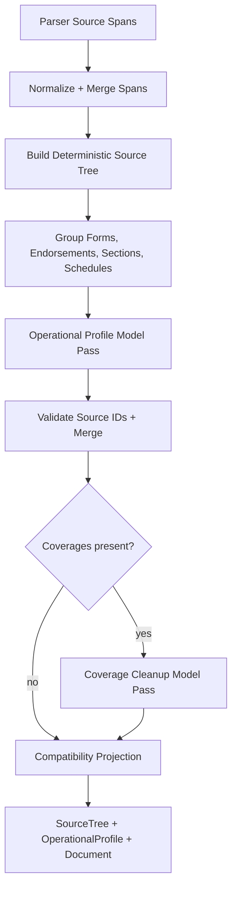

import { Callout } from "@/components/ui/callout";

CL SDK 3.2 uses a source-tree extraction pipeline. The host owns PDF parsing; CL SDK owns deterministic source-tree construction, source-text grouping, source-backed operational fact extraction, citation validation, coverage cleanup, and compatibility projection.

Raw-PDF page-map extraction, focused extractor dispatch, form-inventory model calls, source-tree organizer model calls, and review-mode follow-up extractors are not part of the current published extraction path.

## Quick start

```typescript
import { buildPageSourceSpans, createExtractor } from "@claritylabs/cl-sdk";

const sourceSpans = buildPageSourceSpans([
  {
    documentId: "doc-123",
    sourceKind: "policy_pdf",
    pageNumber: 1,
    text: pageOneText,
  },
]);

const extractor = createExtractor({
  generateObject: myGenerateObject,
  onProgress: (msg) => console.log(msg),
});

const result = await extractor.extract(pdfBase64, "doc-123", { sourceSpans });

console.log(result.sourceTree?.length);          // canonical source hierarchy
console.log(result.operationalProfile?.coverages); // source-backed coverage units
console.log(result.document);                    // compatibility InsuranceDocument projection
console.log(result.chunks.length);               // 0 on v3 source-tree paths
```

<Callout type="info">
  PDF inputs require `ExtractOptions.sourceSpans`. Use LiteParse, Docling, PDF.js, OCR, or another parser before calling the SDK. Docling inputs are the exception because the SDK derives spans from the serialized Docling document.
</Callout>

## Pipeline overview


```mermaid
flowchart TD
    A[Parser Source Spans] --> B[Normalize + Merge Spans]
    B --> C[Build Deterministic Source Tree]
    C --> D[Group Forms, Endorsements, Sections, Schedules]
    D --> E[Operational Profile Model Pass]
    E --> F[Validate Source IDs + Merge]
    F --> G{Coverages present?}
    G -->|yes| H[Coverage Cleanup Model Pass]
    G -->|no| I[Compatibility Projection]
    H --> I
    I --> J[SourceTree + OperationalProfile + Document]
```

## Phase 1: Normalize source spans

The coordinator merges spans derived from a Docling input with spans passed in `ExtractOptions.sourceSpans`. It normalizes text, removes unusable repeated boilerplate, preserves original span IDs in metadata when text is merged, and derives compatibility `SourceChunk[]` windows.

If no source spans remain, extraction throws. This is intentional: policy extraction no longer falls back to raw PDF page maps.

## Phase 2: Persist source evidence

When `sourceStore` is configured, the coordinator stores source spans and source chunks before building the tree:

```typescript
const extractor = createExtractor({
  generateObject,
  sourceStore,
});
```

Production hosts should also persist `result.sourceTree` in their own hierarchy/index tables. `SourceStore` persists spans and chunks; source-tree persistence is host-owned.

## Phase 3: Build the source tree

`buildDocumentSourceTree()` converts `SourceSpan[]` into `DocumentSourceNode[]`.

The tree preserves:

- document, page group, page, form, endorsement, section, schedule, clause, table, row, cell, and text node kinds
- `sourceSpanIds` for every node
- page ranges and bounding boxes when supplied by the parser
- source order
- stable hierarchy paths

Table structure matters. A Docling or parser row span is canonical evidence for table-derived facts; cell spans remain available for precise highlighting.

## Phase 4: Group source structure

The source-tree extractor groups existing nodes into declarations, policy forms, endorsements, sections, and schedules using source text, form numbers, parser titles, and page structure.

Important constraints:

- grouping may relabel or move existing nodes
- grouping must not invent node IDs, text, page numbers, source spans, or bounding boxes
- separately numbered endorsements remain separate endorsement nodes
- source-heading-derived titles stay terse
- generic table rows are retained in the tree but filtered out of operational-profile prompt context unless they carry product-relevant signals

## Phase 5: Extract the operational profile

The operational profile is the product fact projection. One `generateObject` call receives a bounded evidence packet of high-value declaration, schedule, premium, producer, endorsement, and coverage evidence.

It extracts:

- document type and `policyTypes`
- policy number
- named insured
- insurer and broker
- effective, expiration, and retroactive dates
- premium
- coverage units and nested `limits[]` terms
- parties
- endorsement support facts

Every fact must cite existing `sourceNodeIds` or `sourceSpanIds`. Uncited facts and unknown source IDs are rejected during merge.

## Phase 6: Clean up coverage units

When the profile contains coverages, the SDK may run one bounded cleanup pass. The cleanup pass can keep, drop, or update existing coverage rows and terms by original `coverageIndex`; it should repair projection shape, not invent unsupported coverage rows.

Endorsement schedules are modeled as whole endorsement coverage units with their own `limits[]` terms. The extractor should not flatten adjacent labels into unrelated rows like `Aggregate Limit` without endorsement context.

## Phase 7: Project compatibility output

The final result includes both source-native and compatibility views:

```typescript
interface ExtractionResult {
  sourceTree?: DocumentSourceNode[];
  operationalProfile?: PolicyOperationalProfile;
  sourceSpans: SourceSpan[];
  sourceChunks: SourceChunk[];
  document: InsuranceDocument;
  chunks: DocumentChunk[];
  warnings?: string[];
  tokenUsage: TokenUsage;
  usageReporting: {
    modelCalls: number;
    callsWithUsage: number;
    callsMissingUsage: number;
  };
  performanceReport: PerformanceReport;
  reviewReport: ExtractionReviewReport;
}
```

`document`, `documentMetadata`, and `documentOutline` are materialized views over `sourceTree` and `operationalProfile`. Keep existing screens working with `document`, but use `sourceTree` and `sourceSpans` for source viewers, retrieval, and citations.

`chunks` is empty on v3 source-tree extraction paths. Use `sourceTree` node descriptions and exact spans as the retrieval corpus.

## Provider callbacks

Extraction uses `GenerateObject`:

```typescript
type GenerateObject<T = unknown> = (params: {
  prompt: string;
  system?: string;
  schema: ZodSchema<T>;
  maxTokens: number;
  taskKind?: ModelTaskKind;
  budgetDiagnostics?: ModelBudgetResolution;
  providerOptions?: Record<string, unknown>;
  trace?: Record<string, unknown>;
}) => Promise<{ object: T; usage?: TokenUsage }>;
```

The callback should preserve `providerOptions.sourceSpans`, `providerOptions.sourceChunks`, and `trace` in host telemetry. The operational profile evidence is included in the prompt; source spans/chunks in provider options let hosts correlate model calls with parser evidence.

## Model routing and budgets

Hosts that route tasks to different models should pass per-task capabilities:

```typescript
const extractor = createExtractor({
  generateObject,
  modelCapabilitiesByTaskKind: {
    extraction_operational_profile: { maxOutputTokens: 16000 },
    extraction_coverage_cleanup: { maxOutputTokens: 8000 },
  },
});
```

`resolveModelBudget()` treats task budgets as preferences and diagnostics. When model capabilities provide `maxOutputTokens`, that model maximum is the request cap unless an explicit hard constraint lowers it. This avoids truncating extraction just because a cheap task preference was too low.

## Progress callbacks

Current extraction progress is intentionally small:

```typescript
const extractor = createExtractor({
  generateObject,
  onProgress: (message) => console.log(message),
});
```

Typical messages:

```text
Building source-native document tree...
Source-tree extraction complete.
```

## Retry and schema compatibility

The pipeline uses strictified Zod schemas before `generateObject` calls. `safeGenerateObject()` remains available for custom workflows that need the same strictification, retry, and fallback behavior.
