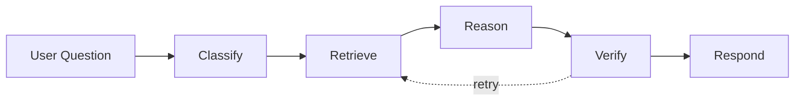
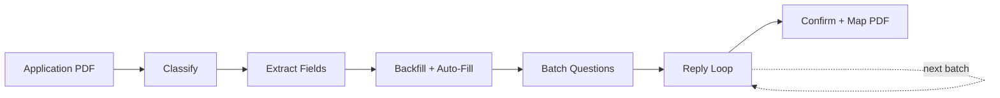

CL SDK is organized into five systems: **document extraction**, **query agent**, **application processing**, **agent prompts**, and **storage & memory**. Each is independent — import only what you need.

## Document extraction pipeline

The core of CL SDK is an agentic pipeline that turns insurance PDFs into structured, queryable data. A coordinator classifies the document, maps each page to focused extractors, builds deterministic tasks, merges repeated extractor runs, reviews for completeness and quality, and assembles the final document.


### Classify

Determines document type (policy or quote) and identifies the lines of business present. Uses `generateObject` with structured output for reliable classification, and passes the full document through `providerOptions.pdfBase64`.

### Page map

Maps each page to one or more focused extractors before task construction. This avoids broad mixed ranges where declaration pages and schedule pages get drowned out by generic policy-form language.

### Plan

Builds deterministic extraction tasks from the page map and the selected line-of-business template. The old broad prompt-only planning path is no longer the active coordinator behavior.

### Extract

Dispatches focused extractors in parallel (concurrency-limited, default 2). Each extractor targets a specific data domain against a page range:

- **Declarations** — named insured, policy number, dates, carrier
- **Coverage limits** — coverage names, limits, deductibles, sub-limits
- **Conditions** — policy conditions and provisions
- **Endorsements** — endorsement schedules and modifications
- **Exclusions** — exclusion language and applicability
- **Loss history** — prior claims and loss runs
- **Named insured** — insured parties and additional insureds
- **Premium breakdown** — line-by-line premium details
- **Sections** — general document sections with page provenance
- **Supplementary** — regulatory context, contacts, fees
- **Carrier info** — carrier details and AM Best ratings

Results accumulate in an in-memory map as each extractor completes. Repeated extractor runs merge instead of overwrite.

Each worker call is page-scoped. Before invoking the callback, the SDK slices the requested range with `extractPageRange()` and passes that PDF through `providerOptions.pdfBase64`, or passes `providerOptions.images` when `convertPdfToImages` is configured.

### Review

A review loop (up to `maxReviewRounds`, default 2) checks completeness and quality against the template and the extracted results. The reviewer sees the document again and is expected to catch generic placeholders, declaration-free schedule outputs, and other weak extraction artifacts before dispatching focused follow-up tasks.

### Assemble

Merges all extractor results into a final `InsuranceDocument`.

### Format

A post-extraction agent pass cleans up markdown formatting in all content-bearing fields — fixing pipe tables missing separator rows, space-aligned tables, sub-items mixed into tables, and general whitespace issues. This ensures sections, endorsements, exclusions, and conditions render correctly in downstream UIs.

### Chunk

Breaks the formatted document into `DocumentChunk` objects for vector storage and retrieval.

## Query agent pipeline

The query agent answers user questions against stored documents with citation-backed provenance. It follows the same coordinator/worker pattern as extraction:



1. **Classify** — determine intent and decompose into atomic sub-questions
2. **Retrieve** (parallel) — semantic chunk search, structured document lookup, and conversation history
3. **Reason** (parallel) — answer each sub-question from evidence only, with intent-specific prompts
4. **Verify** — check grounding (every claim has a citation), consistency, and completeness
5. **Respond** — merge sub-answers into a final response with inline citations

The pipeline uses the same provider-agnostic callbacks (`generateText`, `generateObject`), concurrency control, and retry logic as extraction.

## Application processing pipeline

An agentic pipeline for insurance application intake. Eight small, focused agents handle each step, running in parallel where possible:



1. **Classify** — detect if PDF is an application form (tiny agent, fast model)
2. **Extract fields** — read every field as structured data
3. **Backfill + auto-fill** (parallel) — vector search prior answers, match business context, search document chunks
4. **Batch questions** — organize unfilled fields into topic-based batches
5. **Reply loop** — route reply intent, parse answers / handle lookups / explain fields, advance batch
6. **Confirm + map PDF** — generate confirmation summary, write answers to PDF

Persistent `ApplicationStore` tracks state across the multi-turn collection. `BackfillProvider` enables vector-based answer reuse from prior applications.

## Agent prompt system

A composable system for building insurance-aware conversational agents:

```
buildAgentSystemPrompt(ctx)
  ├── Identity          — agent name, company context
  ├── Intent            — direct / mediated / observed behavior
  ├── Formatting        — platform-specific output rules
  ├── Safety            — scope guardrails, anti-hallucination
  ├── Coverage gaps     — gap detection guidance
  ├── COI routing       — certificate of insurance handling
  ├── Quotes/policies   — document type differentiation
  └── Memory            — cross-conversation continuity
```

Each module is independently importable for custom composition. The system supports five platforms (email, chat, SMS, Slack, Discord) and three communication intents (direct, mediated, observed).

## Design principles

- **Provider-agnostic** — uses plain callback functions (`GenerateText`, `GenerateObject`). Wrap any LLM provider — no framework dependency.
- **Pure TypeScript** — no framework dependencies. Works in Node.js, Deno, edge runtimes.
- **Fail gracefully** — page-aware planning, merged follow-up extraction, review loops that check quality as well as completeness, and adaptive retry with exponential backoff.
- **Schema-only tools** — tool definitions provide schemas without implementations, so consumers control execution.
