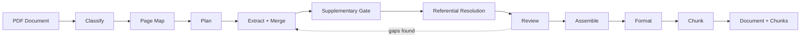
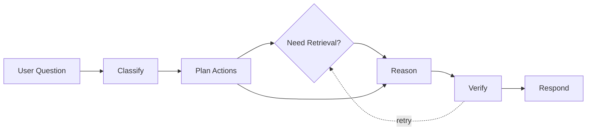
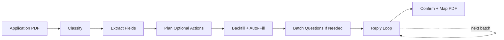

CL SDK is organized into eight systems: **document extraction**, **source grounding**, **query agent**, **application processing**, **policy change endorsements**, **case workflows**, **agent prompts**, and **storage & memory**. Each is independent -- import only what you need.

## Document extraction pipeline

The core of CL SDK is an agentic pipeline that turns insurance PDFs into structured, queryable data. A coordinator classifies the document, maps each page to focused extractors, builds deterministic tasks, merges repeated extractor runs, resolves referential values, reviews for completeness and quality, and assembles the final document. Deterministic gates avoid unnecessary model calls while still preserving agentic follow-up paths for edge cases.



### Classify

Determines document type (policy or quote) and identifies the lines of business present. Uses `generateObject` with structured output for reliable classification, and passes the full document through `providerOptions.pdfBase64` for PDF inputs or `providerOptions.doclingText` for host-provided Docling inputs.

### Page map

Maps each page to one or more focused extractors before task construction. This avoids broad mixed ranges where declaration pages and schedule pages get drowned out by generic policy-form language.

### Plan

Builds extraction tasks from the model-produced page map and the selected line-of-business template.

### Extract

Dispatches focused extractors in parallel (concurrency-limited, default 2; override with `extractorConcurrency`). Each extractor targets a specific data domain against a page range:

- **Declarations** — named insured, policy number, dates, carrier
- **Coverage limits** — coverage names, limits, deductibles, sub-limits
- **Definitions** — defined terms and full definition text with provenance
- **Covered reasons** — covered causes, covered losses, inclusions, and qualifying coverage triggers
- **Conditions** — policy conditions and provisions
- **Endorsements** — endorsement schedules and modifications
- **Exclusions** — exclusion language and applicability
- **Loss history** — prior claims and loss runs
- **Named insured** — insured parties and additional insureds
- **Premium breakdown** — line-by-line premium details
- **Sections** — general document sections with page provenance
- **Supplementary** — regulatory context, contacts, fees
- **Carrier info** — carrier details and AM Best ratings

Results accumulate in an in-memory map as each extractor completes. Repeated extractor runs merge instead of overwrite.

Each worker call is page-scoped. Before invoking the callback, the SDK slices the requested range and passes that PDF through `providerOptions.pdfBase64`, passes `providerOptions.images` when `convertPdfToImages` is configured, or passes page-scoped `providerOptions.doclingText` for Docling inputs. Page-scoped PDFs, rendered image ranges, Docling text ranges, and in-flight range work are cached for the duration of an extraction.

Focused extractors can declare fallback behavior. Definitions and covered reasons fall back through section extraction when a focused run fails or returns no usable records, which prevents a single model no-output response from leaving those first-class fields empty.

### Supplementary and referential gates

Supplementary extraction is conditional. It runs only when page assignments, form inventory, existing extracted text, or review follow-up tasks indicate regulatory, claims, notice, cancellation/nonrenewal, contact, or TPA facts are likely present. Page/form signals are run as narrow page-scoped tasks with the main extractor batch.

Referential coverage values use a bounded resolver: cheap local section/form matches first, then target-specific actions for declarations, schedules, sections, page-location lookup, or skip. This improves edge-case reliability without always launching extra lookup calls.

### Review

Deterministic quality checks always run. The LLM review loop (up to `maxReviewRounds`, default 2) checks completeness and quality against the template and extracted results when `reviewMode` allows it. `reviewMode: "auto"` skips the expensive LLM review only when deterministic checks are clean and source spans are available.

### Assemble

Merges all extractor results into a final `InsuranceDocument`.

### Format

A post-extraction formatting pass cleans up markdown in content-bearing fields only when the content is likely to need it — long text, markdown artifacts, lists/headings, excessive spacing, or table-like content. Plain prose skips the LLM formatting call. This ensures sections, definitions, covered reasons, endorsements, exclusions, and conditions render correctly in downstream UIs without paying for unnecessary no-op cleanup.

### Chunk

Breaks the formatted document into `DocumentChunk` objects for vector storage and retrieval.

## Source grounding

Source grounding is the shared evidence layer in v1. A `SourceSpan` captures a page, section, text range, and stable hash for a piece of source material. Extraction can receive spans through `extract(pdfBase64, documentId, { sourceSpans })`, or derive them from Docling provenance when `extract({ kind: "docling_document", ... })` is used; those spans are filtered by page range and sent to focused extractors as `providerOptions.sourceSpans` and `providerOptions.sourceChunks`.

The same primitives are reused by query, application, PCE, and case workflows:

- **Source spans** preserve page and section provenance for extracted facts.
- **Source chunks** turn spans into retrievable text windows without losing the original span IDs.
- **Source stores and retrievers** let hosts persist spans and search them alongside vector chunks.
- **Quoted evidence validation** checks that agent decisions cite real source text before a workflow is considered ready for automation.

## Query agent pipeline

The query agent answers user questions against stored documents and inbound attachments with citation-backed provenance. It follows the same deterministic scaffold plus agentic decision-point pattern as extraction:



1. **Classify** — determine intent and decompose into atomic sub-questions
2. **Plan actions** — decide whether retrieval is needed from classification and attachment evidence
3. **Retrieve** (parallel, when needed) — semantic chunk search, structured document lookup, and conversation history
4. **Reason** (parallel) — answer each sub-question from retrieved evidence, attachment evidence, or no-retrieval context when lookup is unnecessary
5. **Verify** — check grounding (every claim has a citation when evidence exists), consistency, and completeness
5. **Respond** — merge sub-answers into a final response with inline citations

Simple or attachment-only questions can skip retrieval entirely. Verification can still request targeted retry retrieval/reasoning when evidence is weak.

The pipeline uses the same provider-agnostic callbacks (`generateText`, `generateObject`), concurrency control, and retry logic as extraction.

## Application processing pipeline

An agentic workflow for insurance application intake. Small, focused agents handle each step, with a deterministic planner gating optional calls so the pipeline does not run every agent on every application:



1. **Classify** — detect if PDF is an application form (tiny agent, fast model)
2. **Extract fields** — read every field as structured data
3. **Plan optional actions** — decide whether prior-answer backfill, context auto-fill, document search, or batching is useful from the current state and available stores/context
4. **Backfill + auto-fill** — vector search prior answers, match business context, search selected high-value document fields
5. **Batch questions** — organize remaining unfilled fields into topic-based batches only when unfilled fields remain
6. **Reply loop** — route reply intent, then run only the needed actions: parse answers, handle lookups, explain fields, advance batch, or generate the next email
7. **Confirm + map PDF** — generate confirmation summary, write answers to PDF

Persistent `ApplicationStore` tracks state across the multi-turn collection. `BackfillProvider` enables vector-based answer reuse from prior applications.

Application processing can also receive `sourceSpans` on `processApplication`. Those spans are forwarded into classification, field extraction, auto-fill, lookup, and explanation calls so filled fields can carry evidence instead of ungrounded model notes.

## Policy change endorsement pipeline

The PCE workflow turns a requested policy change into reviewable, carrier-ready work:


The agent extracts change items, links each item to quoted policy or conversation evidence, runs quality gates, and generates a submission packet. Execution mode selection separates draft-only, assisted, and automation-eligible paths from the same typed result.

## Case workflows

Case primitives provide shared state for workflows that need proposals, approvals, evidence, and dedupe decisions. PCE uses them for change proposals, but the same exports are available for claims intake, COI workflows, renewal prep, and other agent tasks that need durable human-review state.

## Agent prompt system

A composable system for building insurance-aware conversational agents:

```
buildAgentSystemPrompt(ctx)
  ├── Identity          — agent name, company context
  ├── Intent            — direct / mediated / observed behavior
  ├── Formatting        — platform-specific output rules
  ├── Safety            — scope guardrails, anti-hallucination
  ├── Coverage gaps     — gap detection guidance
  ├── COI routing       — certificate of insurance handling
  ├── Quotes/policies   — document type differentiation
  └── Memory            — cross-conversation continuity
```

Each module is independently importable for custom composition. The system supports five platforms (email, chat, SMS, Slack, Discord) and three communication intents (direct, mediated, observed).

## Design principles

- **Provider-agnostic** -- uses plain callback functions (`GenerateText`, `GenerateObject`). Wrap any LLM provider -- no framework dependency.
- **Pure TypeScript** — no framework dependencies. Works in Node.js, Deno, edge runtimes.
- **Fail gracefully** — page-aware planning, bounded workflow gates, merged follow-up extraction, review loops that check quality as well as completeness, and adaptive retry with exponential backoff.
- **Schema-only tools** — tool definitions provide schemas without implementations, so consumers control execution.
