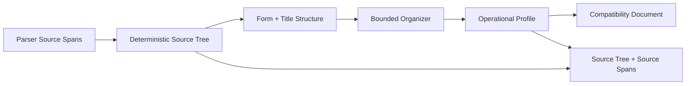
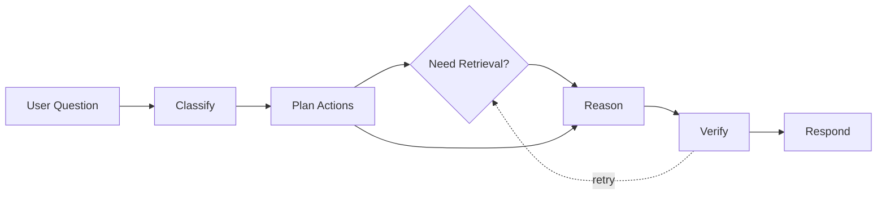
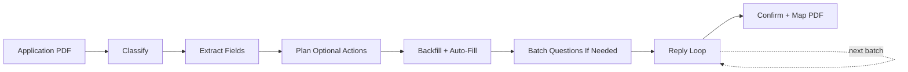

CL SDK is organized into eight systems: **document extraction**, **source grounding**, **query agent**, **application processing**, **policy change endorsements**, **case workflows**, **agent prompts**, and **storage & memory**. Each is independent -- import only what you need.

## Document extraction pipeline

The core of CL SDK is a source-tree pipeline that turns parser-provided insurance PDF spans into a canonical hierarchy plus source-backed operational facts. When source spans are available, the extractor builds deterministic document/page/table/row/cell nodes, uses form-inventory page ranges as a conservative skeleton, promotes title elements into section/schedule hierarchy across page breaks, runs bounded organizer cleanup over existing node IDs, extracts only cited operational facts, and returns a compatibility `InsuranceDocument` projection for existing hosts.



### Source tree

The deterministic builder converts `SourceSpan` records into `DocumentSourceNode` rows. Page spans become page nodes, LiteParse/Docling tables become table/row/cell nodes, section candidates become section/schedule/clause/endorsement nodes, and all nodes retain source span IDs, page ranges, bounding boxes, source order, and path. Form inventory, when supplied or inferable from page spans, establishes expected page ranges for front matter, declarations, policy forms, and endorsements. Parser title elements then split continuous content into sections/schedules inside those forms, including content that starts on one page and continues on the next.

### Organizer

The organizer prompt may label existing nodes and group adjacent nodes into continuous forms, schedules, clauses, page groups, declaration sets, or a generic `Endorsements` page-group parent. It also receives compact form-inventory/page-range hints so cleanup follows the standard order: notices/front matter, declarations, policy form, endorsements. Separately numbered endorsements remain individual endorsement child nodes; the organizer must not merge them into one endorsement node or use range titles such as `Endorsements 1-3`. Titles stay terse and source-heading-derived, such as `Declarations`, `Policy Form`, `Definitions`, `Endorsements`, or `Endorsement No. 3`, without parenthetical summaries. It sees all top-level page/form candidates rather than a prefix of low-level descendants, with only bounded direct-child context for naming. It cannot invent text, pages, source spans, or bounding boxes. If the organizer fails, the deterministic tree is still usable.

### Operational profile

The operational profile extractor pulls only high-value facts needed for policy lists, compliance, Q&A, and COIs: policy number, named insured, insurer, broker, policy period, retroactive date, premiums, coverage rows, limits, deductibles, and endorsement support. Every returned value must cite `sourceNodeIds` or `sourceSpanIds`; uncited values are rejected.

### Compatibility projection

`result.document`, `documentMetadata`, and `documentOutline` are materialized views over the source tree and operational profile. Hosts can keep existing screens working, but retrieval and source viewers should index `sourceTree` and use `sourceSpans` for exact highlights. `result.chunks` is empty on v3 source-tree paths.

## Source grounding

Source grounding is the shared evidence layer. A `SourceSpan` captures a page, section, text range, stable hash, and optional bounding boxes for a source unit. A `DocumentSourceNode` groups spans into hierarchy and is the primary search/index unit for Q&A and source-backed workflows.

The same primitives are reused by query, application, PCE, and case workflows:

- **Source spans** preserve page and section provenance for extracted facts.
- **Source nodes** preserve hierarchy and provide retrievable descriptions.
- **Source chunks** remain compatibility windows during migration.
- **Source stores and retrievers** let hosts persist spans/nodes and search them alongside vector chunks.
- **Quoted evidence validation** checks that agent decisions cite real source text before a workflow is considered ready for automation.

## Query agent pipeline

The query agent answers user questions against stored documents and inbound attachments with citation-backed provenance. It follows the same deterministic scaffold plus agentic decision-point pattern as extraction:



1. **Classify** — determine intent and decompose into atomic sub-questions
2. **Plan actions** — decide whether retrieval is needed from classification and attachment evidence
3. **Retrieve** (parallel, when needed) — semantic chunk search, structured document lookup, and conversation history
4. **Reason** (parallel) — answer each sub-question from retrieved evidence, attachment evidence, or no-retrieval context when lookup is unnecessary
5. **Verify** — check grounding (every claim has a citation when evidence exists), consistency, and completeness
5. **Respond** — merge sub-answers into a final response with inline citations

Simple or attachment-only questions can skip retrieval entirely. Verification can still request targeted retry retrieval/reasoning when evidence is weak.

The pipeline uses the same provider-agnostic callbacks (`generateText`, `generateObject`), concurrency control, and retry logic as extraction.

## Application processing pipeline

An agentic workflow for insurance application intake. Small, focused agents handle each step, with a deterministic planner gating optional calls so the pipeline does not run every agent on every application:



1. **Classify** — detect if PDF is an application form (tiny agent, fast model)
2. **Extract fields** — read every field as structured data
3. **Plan optional actions** — decide whether prior-answer backfill, context auto-fill, document search, or batching is useful from the current state and available stores/context
4. **Backfill + auto-fill** — vector search prior answers, match business context, search selected high-value document fields
5. **Batch questions** — organize remaining unfilled fields into topic-based batches only when unfilled fields remain
6. **Reply loop** — route reply intent, then run only the needed actions: parse answers, handle lookups, explain fields, advance batch, or generate the next email
7. **Confirm + map PDF** — generate confirmation summary, write answers to PDF

Persistent `ApplicationStore` tracks state across the multi-turn collection. `BackfillProvider` enables vector-based answer reuse from prior applications.

Application processing can also receive `sourceSpans` on `processApplication`. Those spans are forwarded into classification, field extraction, auto-fill, lookup, and explanation calls so filled fields can carry evidence instead of ungrounded model notes.

## Policy change endorsement pipeline

The PCE workflow turns a requested policy change into reviewable, carrier-ready work:


The agent extracts change items, links each item to quoted policy or conversation evidence, runs quality gates, and generates a submission packet. Execution mode selection separates draft-only, assisted, and automation-eligible paths from the same typed result.

## Case workflows

Case primitives provide shared state for workflows that need proposals, approvals, evidence, and dedupe decisions. PCE uses them for change proposals, but the same exports are available for claims intake, COI workflows, renewal prep, and other agent tasks that need durable human-review state.

## Agent prompt system

A composable system for building insurance-aware conversational agents:

```
buildAgentSystemPrompt(ctx)
  ├── Identity          — agent name, company context
  ├── Intent            — direct / mediated / observed behavior
  ├── Formatting        — platform-specific output rules
  ├── Safety            — scope guardrails, anti-hallucination
  ├── Coverage gaps     — gap detection guidance
  ├── COI routing       — certificate of insurance handling
  ├── Quotes/policies   — document type differentiation
  └── Memory            — cross-conversation continuity
```

Each module is independently importable for custom composition. The system supports five platforms (email, chat, SMS, Slack, Discord) and three communication intents (direct, mediated, observed).

## Design principles

- **Provider-agnostic** -- uses plain callback functions (`GenerateText`, `GenerateObject`). Wrap any LLM provider -- no framework dependency.
- **Pure TypeScript** — no framework dependencies. Works in Node.js, Deno, edge runtimes.
- **Fail gracefully** — page-aware planning, bounded workflow gates, merged follow-up extraction, review loops that check quality as well as completeness, and adaptive retry with exponential backoff.
- **Schema-only tools** — tool definitions provide schemas without implementations, so consumers control execution.
