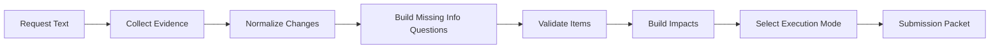

The PCE agent uses deterministic scaffolding around optional model calls. When `generateObject` is not configured, it still performs heuristic normalization and validation so hosts can test the workflow without provider access.



## 1. Collect evidence

`collectPceEvidenceSources()` combines explicit `evidenceSources` from the request with source retrieval results:

```typescript
const evidence = await collectPceEvidenceSources(
  {
    requestText,
    evidenceSources: explicitSources,
  },
  {
    sourceRetriever,
    retrievalLimit: 8,
  },
);
```

Evidence is normalized into `PceEvidenceSource` records with IDs, labels, text, optional document/page fields, and metadata.

## 2. Normalize requested changes

`createPceAgent().processChangeRequest()` uses `buildPceNormalizePrompt()` and `PceNormalizationResultSchema` when a provider is available. The fallback parser creates draft change items from the request text and still runs validation.

## 3. Ask for missing information

Missing-info questions are tied to `itemId` and `fieldPath`, which lets hosts render a clear follow-up email or chat reply. `processReply()` parses user answers and merges them with `mergeQuestionAnswers()`.

```typescript
const reply = await pce.processReply({
  state,
  replyText: "The effective date should be June 1, 2026.",
});
```

## 4. Validate items

`validatePceItems()` checks the normalized items against available evidence. Blocking issues prevent automation-eligible packets. Warnings can still be included for reviewer attention.

## 5. Select execution mode

`selectPceExecutionMode()` chooses from:

- `deterministic_tree`: constrained flow where deterministic checks are sufficient.
- `market_eval`: review-heavy mode for ambiguous or market-specific changes.
- `hybrid`: deterministic scaffolding with model-assisted interpretation and review.

Pass `executionMode: "auto"` to let the SDK choose, or force a mode for a product surface.
