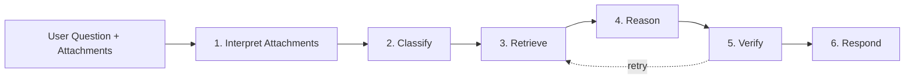

The query agent pipeline answers user questions against stored insurance documents and inbound multimodal context. It mirrors the extraction pipeline's coordinator/worker pattern — attachments are interpreted first, a classifier decomposes questions, retrievers pull evidence in parallel, reasoners answer from evidence only, and a verifier checks grounding before composing the final response.

## Quick start

```typescript
import { createQueryAgent } from "@claritylabs/cl-sdk";

const agent = createQueryAgent({
  generateText,       // your LLM text callback
  generateObject,     // your LLM structured output callback
  documentStore,      // where extracted documents live
  memoryStore,        // where document chunks + conversation history live
});

const result = await agent.query({
  question: "What is the deductible on our GL policy?",
  conversationId: "conv-123",
});

console.log(result.answer);     // "The general liability policy has a $1,000 per-occurrence deductible [1]."
console.log(result.citations);  // [{ index: 1, chunkId: "doc-456:coverage:0", quote: "...", ... }]
console.log(result.confidence); // 0.92
```

You can also pass inbound attachments with the question:

```typescript
const result = await agent.query({
  question: "What details should we collect from this photo, and is there policy context?",
  conversationId: "conv-123",
  attachments: [
    {
      kind: "image",
      name: "damage.jpg",
      mimeType: "image/jpeg",
      base64: damagePhotoBase64,
    },
    {
      kind: "pdf",
      name: "coi.pdf",
      mimeType: "application/pdf",
      base64: coiPdfBase64,
    },
  ],
});
```

## Pipeline phases

The pipeline runs six phases, with parallel dispatch in phases 3 and 4:



### Phase 1: Interpret attachments

If `input.attachments` are present, the pipeline interprets each image, PDF, or text payload into synthetic evidence before any retrieval happens.

This is what enables flows like:

- tenant texts a damage photo over SMS
- insured emails a COI PDF and asks what is missing
- operations forwards an email body plus attachments into Prism

Each attachment becomes an `EvidenceItem` with:

- attachment-derived summary text
- extracted facts
- follow-up details worth asking about
- a stable source ID that can be cited downstream

### Phase 2: Classify

The classifier analyzes the question and produces:

- **Intent** — `policy_question`, `coverage_comparison`, `document_search`, `claims_inquiry`, or `general_knowledge`
- **Sub-questions** — atomic questions that can each be independently retrieved and answered
- **Storage requirements** — which backends to query (chunks, documents, conversation history)

Simple questions produce one sub-question. Complex questions like "compare the deductibles on my GL and auto policies" decompose into multiple sub-questions, each targeting different documents.

When attachments are present, the classifier also sees an attachment summary so it can route questions correctly even when the crucial context is visual or comes from an inbound PDF.

### Phase 3: Retrieve (parallel)

For each sub-question, a retriever runs in parallel (concurrency-limited, default 3):

1. **Chunk search** — semantic search over document chunks using the memory store's embedding-based similarity
2. **Document lookup** — structured query by carrier, policy number, insured name, or document type
3. **Conversation history** — search prior conversation turns for context

Each retriever returns ranked `EvidenceItem` objects with source references and relevance scores. Attachment evidence from phase 1 is then merged into the retrieved evidence set.

### Phase 4: Reason (parallel)

For each sub-question, a reasoner receives **only the evidence set** — attachment evidence plus retrieved chunk/document/conversation evidence, but never the full raw corpus. This forces grounding. The reasoner produces a `SubAnswer` with:

- Text answer to the sub-question
- Citations referencing specific evidence items
- Confidence score (0–1)
- Flag if evidence was insufficient

Reasoning prompts are intent-specific. Coverage questions get prompts tuned for interpreting limits, deductibles, and endorsements. Claims questions get prompts tuned for dates, amounts, and statuses.

### Phase 5: Verify

The verifier checks all sub-answers for:

1. **Grounding** — every factual claim must have a citation that actually contains the claimed information
2. **Consistency** — sub-answers must not contradict each other
3. **Completeness** — each sub-question must be adequately answered

If issues are found and the verify round limit hasn't been reached, the verifier triggers re-retrieval with broader context and re-reasoning for flagged sub-questions.

### Phase 6: Respond

The responder merges verified sub-answers into a single natural-language response with:

- Inline citations (`[1]`, `[2]`) referencing source documents
- Deduplicated citation list
- Weighted confidence score
- Optional follow-up suggestion

The exchange is stored as conversation turns in the memory store for future context.

## Configuration

```typescript
const agent = createQueryAgent({
  // Required: LLM callbacks (same as extraction pipeline)
  generateText,
  generateObject,

  // Required: storage backends
  documentStore,
  memoryStore,

  // Optional: tuning
  concurrency: 3,        // max parallel retrievers/reasoners (default: 3)
  maxVerifyRounds: 1,    // verification loop iterations (default: 1)
  retrievalLimit: 10,    // max evidence items per sub-question (default: 10)

  // Optional: observability
  onTokenUsage: (usage) => void,   // token tracking per LLM call
  onProgress: (message) => void,   // status at each phase transition
  log: async (message) => void,    // detailed logging
  providerOptions: {},             // passed through to every LLM call
});
```

## Attachment transport requirements

Attachment-aware querying depends on your `generateObject` callback correctly forwarding multimodal content from `providerOptions` into the provider request:

- `providerOptions.attachments` contains the generic raw attachment payloads
- `providerOptions.pdfBase64` is set for PDF attachments
- `providerOptions.images` is set for image attachments

If your callback ignores those values, attachment interpretation will not have access to the actual file contents.

## Evidence-first design

The key architectural decision is that reasoners only see evidence, never full documents. This:

- **Forces grounding** — the model can't hallucinate from vague document knowledge
- **Enables citation tracking** — every claim traces to a specific chunk
- **Limits context** — focused evidence windows produce more precise answers
- **Supports verification** — the verifier can check claims against the same evidence set
