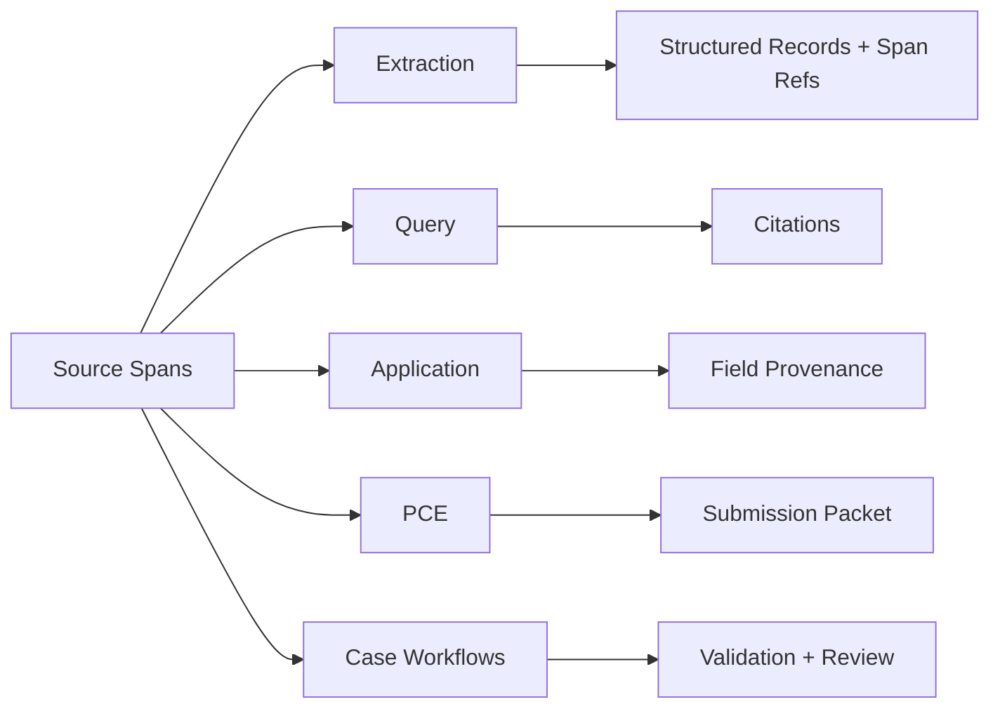

Source grounding is the evidence layer. In v3, source spans remain the smallest addressable units, and extraction builds a retrievable source tree above them so every workflow can reason over document hierarchy without losing exact PDF provenance.

## Core objects

- `SourceSpan` is the smallest addressable source unit. It stores source kind, text, page range, optional section/form metadata, a stable hash, and optional bounding boxes.
- `DocumentSourceNode` is the canonical retrieval and hierarchy unit. It groups spans into document, page group, form, endorsement, section, schedule, clause, table, row, cell, and text nodes.
- `PolicyOperationalProfile` is a source-backed projection for product-critical facts such as policy number, named insured, insurer, broker, policy period, coverage rows, limits, deductibles, premiums, and endorsement support.
- `SourceChunk` remains a compatibility retrieval window while hosts migrate to source-node indexes.
- `SourceSpanRef` is a lightweight reference used by extracted records and downstream workflows.
- `SourceStore` persists spans/chunks and implements `SourceRetriever`; production hosts should add `searchSourceNodes` for v3 source-tree retrieval.

## Where spans are used



Extraction builds a deterministic source tree from spans, applies form-inventory/page-range hints when available, promotes parser title elements into section/schedule nodes inside the matching form, then runs bounded model cleanup only over existing node IDs. The hierarchy is content-first: declarations, policy forms, endorsements, sections, schedules, and tables are structure; pages are provenance. The organizer groups adjacent separately numbered endorsements under one generic `Endorsements` page-group parent while preserving each endorsement as an individual child node; it must not merge multiple endorsements into one endorsement node or use synthesized range titles. It then extracts only source-cited operational facts. Query and PCE use retrievers to find source nodes, expand ancestors/siblings/children, and attach exact spans for citations. Application processing forwards spans into classification, field extraction, lookup, and explanation agents. Case workflows validate quoted evidence before proposals are scored or packets are generated.

## Minimal setup

```typescript
import {
  MemorySourceStore,
  buildPageSourceSpans,
  createExtractor,
} from "@claritylabs/cl-sdk";

const sourceSpans = buildPageSourceSpans([
  {
    documentId: "policy-123",
    sourceKind: "policy_pdf",
    pageNumber: 1,
    text: "Commercial General Liability Declarations...",
  },
]);

const sourceStore = new MemorySourceStore();
const extractor = createExtractor({ generateText, generateObject, sourceStore });

const result = await extractor.extract("base64-pdf", "policy-123", { sourceSpans });
```

`MemorySourceStore` is a reference implementation for tests and small hosts. Production systems usually store spans in the same database as documents, store source nodes in a hierarchy table, and index node descriptions in vector or hybrid search.

## Design rules

- Keep spans stable. IDs should change only when the underlying source text changes.
- Keep source nodes parser-grounded. LLM organization may label or group existing node IDs, but must not invent text, pages, spans, or bounding boxes.
- Use form inventory as a skeleton hint, not as invented evidence. Page ranges can group existing page/source nodes, but every retained node still needs real source spans.
- Prefer title-derived section hierarchy over page-by-page outlines. Content can continue across page breaks, and section nodes should carry the combined page range.
- Keep quote text short enough to verify, but long enough to identify the policy language.
- Preserve page and form metadata whenever you have it.
- Treat operational profiles as materialized projections. Source nodes and source spans are the canonical evidence for policy wording.
