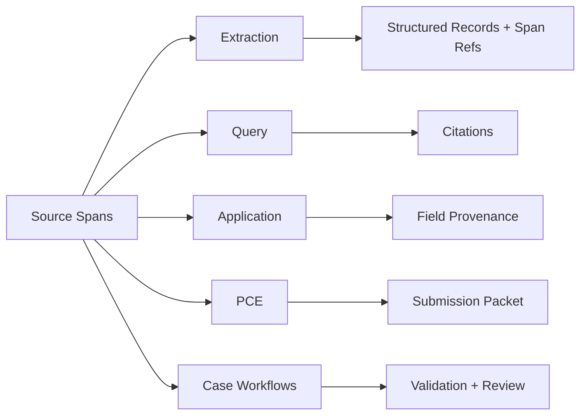

Source grounding is the v1 evidence layer. It gives every workflow a common way to represent where a fact came from, how to retrieve it, and whether an agent decision is backed by quoted source text.

## Core objects

- `SourceSpan` is the smallest addressable source unit. It stores source kind, text, page range, optional section/form metadata, a stable hash, and optional bounding boxes.
- `SourceChunk` groups spans into retrieval windows while keeping the original span IDs.
- `SourceSpanRef` is a lightweight reference used by extracted records and downstream workflows.
- `SourceStore` persists spans/chunks and implements `SourceRetriever`.

## Where spans are used



Extraction filters spans by page range and passes focused source context into each extractor. Query and PCE use retrievers to find evidence. Application processing forwards spans into classification, field extraction, lookup, and explanation agents. Case workflows validate quoted evidence before proposals are scored or packets are generated.

## Minimal setup

```typescript
import {
  MemorySourceStore,
  buildPageSourceSpans,
  createExtractor,
} from "@claritylabs/cl-sdk";

const sourceSpans = buildPageSourceSpans([
  {
    documentId: "policy-123",
    sourceKind: "policy_pdf",
    pageNumber: 1,
    text: "Commercial General Liability Declarations...",
  },
]);

const sourceStore = new MemorySourceStore();
const extractor = createExtractor({ generateText, generateObject, sourceStore });

const result = await extractor.extract("base64-pdf", "policy-123", { sourceSpans });
```

`MemorySourceStore` is a reference implementation for tests and small hosts. Production systems usually store spans in the same database as documents and index chunks in a vector or hybrid search system.

## Design rules

- Keep spans stable. IDs should change only when the underlying source text changes.
- Keep quote text short enough to verify, but long enough to identify the policy language.
- Preserve page and form metadata whenever you have it.
- Treat source spans as evidence, not truth. The workflow still needs schema validation, review, and conflict handling.
